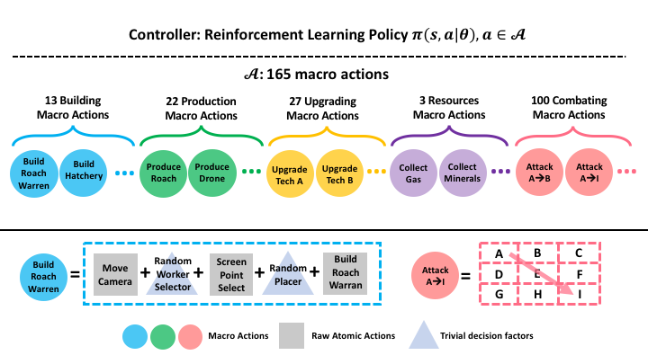

# SC2Learner (TStarBot1) - Macro-action-based StarCraft-II Reinforcement Learning Environment

## Overview

<p align="center">

<br/>Overview of Macro Action Space for SC2Learner (TStarBot1).
</p>

## Dependencies

- Python >= 3.5.2 required.

- PySC2-folk: https://github.com/Tencent-Game-AI/pysc2.git

## Installation

```bash
pip3 install -e .
```

## How to Run

### Run Random Agent
```bash
python3 -m sc2learner.bin.evaluate --agent random --difficulty '1'
```

### Train PPO Agent

- Start Actors
```bash
for i in $(seq 0 128); do
  python3 -m sc2learner.bin.train_ppo --job_name=actor --learner_ip localhost &
done;
```

- Start Learner
```bash
python3 -m sc2learner.bin.train_ppo --job_name learner
```

### Evaluate PPO Agent
```bash
python3 -m sc2learner.bin.eval --agent ppo --model_path REPLACE_WITH_YOUR_OWN_MODLE_PATH
```
###

### Play vs. PPO Agent

- Start Human Player's Client
```bash
python3 -m pysc2.bin.play_vs_agent --human --map AbyssalReef --user_race zerg
```

- Start PPO Agent
```bash
python3 -m sc2learner.bin.play_vs_ppo_agent --model_path REPLACE_WITH_YOUR_OWN_MODLE_PATH
```

### Selfplay Train PPO Agent

- Start Actors
```bash
for i in $(seq 0 128); do
  python3 -m sc2learner.bin.train_ppo_selfplay --job_name=actor --learner_ip localhost &
done;
```

- Start Learner
```bash
python3 -m sc2learner.bin.train_ppo_selfplay --job_name learner
```
