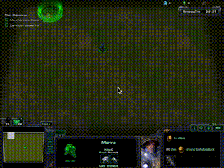
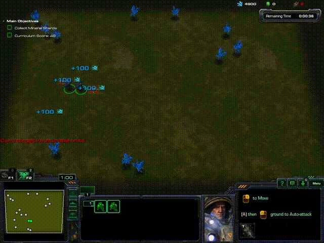
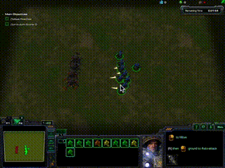

# Primitive Experimental Results for StarCraft-II

## Mini-Games with Restricted Obs/Acation Spaces

MiniGame                | Ours-Restricted   |  Random   | DeepMind | Human
:---------------------  | ---------------:  | -----:    | ----:    | -----:
*MoveToBeacon*          |     26.1          |   1       | 26       | 26
*CollectMineralShards*  |     96.2          |   17      | 103      | 133 
*DefeatRoaches*         |     87.0          |   1       | 100      | 41

Possible reasons for the current performance gap:

- **Not Fully Converged**: 60M game steps in our results VS. 600M in DeepMind's.
- **No Hyper-paramter Tuning**: DeepMind conducted a careful random hyper-parameter selection, while in our's, no hyper-parameter selection was performed.
- **Simplified Observation and action spaces**: we only use a single feature layer (*screen.relative\_player*) and a single action (*move\_attack*), while DeepMind utilizes the full spaces.

  

## Mini-Games with Full Obs/Acation Spaces

(On-going)

MiniGame                | Ours-Restricted   |  Ours-Full  | Random   | DeepMind | Human
:---------------------  | ---------------:  | ----------: | -----:   | ----:    | -----:
*MoveToBeacon*          |     26.1          |   -         |  1       | 26       | 26
*CollectMineralShards*  |     96.2          |   -         |  17      | 103      | 133 
*DefeatRoaches*         |     87.0          |   -         |  1       | 100      | 41
*DefeatZerglingsAndBanelings*|49.3          |   -         |  23      | 62       | 729
*FindAndDefeatZerglings*|     18.3          |   -         |  4       | 45       | 46
*CollectMineralAndGas   |     -             |   -         |  12      | 3978     | 6880
*BuildMarines*          |     -             |   -         |  < 1     | 3        | 138
